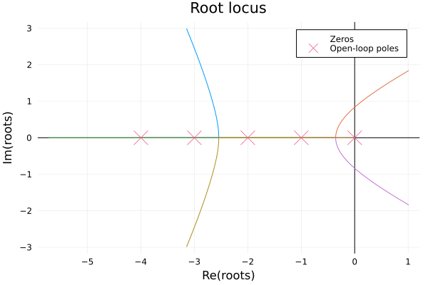

# Root Locus

Root locus is an important analysis method in systems, we can use the root locus to judge whether the system is stable or not, it is also very convienent to draw root locus in FractionalSystems.jl:

Let's see if we have a fractional order transfer function model:

```math
G(s)=\frac{1}{s^{3.5}+10s^{2.8}+35s^{2.1}+50s^{1.4}+24s^{0.7}}
```

All we need to do is abstract the model and plot the locus:

```julia
G = fotf([1], [0], [1, 10, 35, 50, 24], [3.5, 2.8, 2.1, 1.4, 0.7])
rlocus(G)
```



### Another example

Let's see the fractional order transfer function is:

```math
G(s) = \frac{-2s^{0.63}-4}{2s^{3.501}+3.8s^{2.42}+2.6s^{1.798}+2.5s^{1.31}+1.5}
```

We need to know the root locus of the fractional order model is in fact the root locus of the **commensurate order** model based on the original fractional order model, so in this example, while the **base order** is $\lambda=s^{0.001}$, which means the highest order of the commensurate order model is $3501$!! It is troublesome to handle this in ControlSystems.jl, so we can approximate the order as:

```math
G(s)=\frac{-2s^{0.6}-4}{2s^{3.5}+3.8s^{2.4}+2.6s^{1.8}+2.5s^{1.3}+1.5}
```

Then abstract the model! Plot the root locus!

```julia
b=fotf([-2, -4], [0.6, 0], [2, 3.8, 2.6, 2.5, 1.5], [3.5, 2.4, 1.8, 1.3, 0])
rlocus(b)
```

